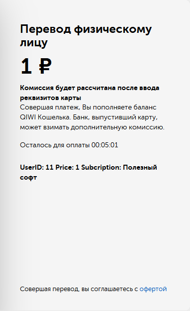
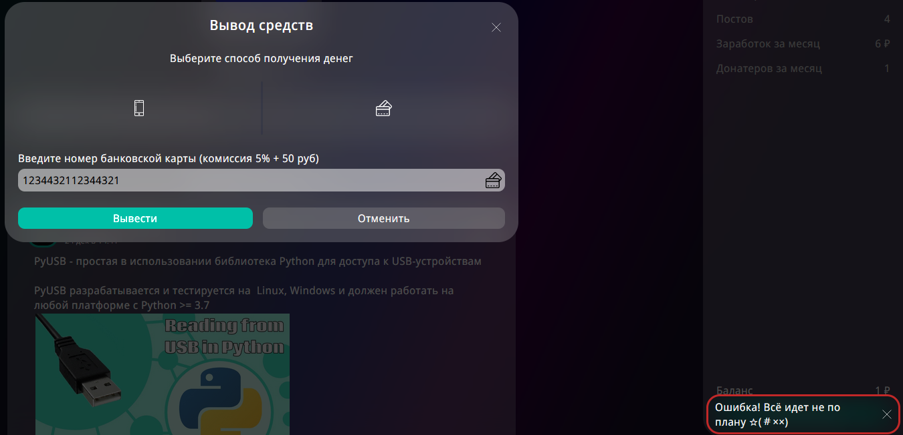
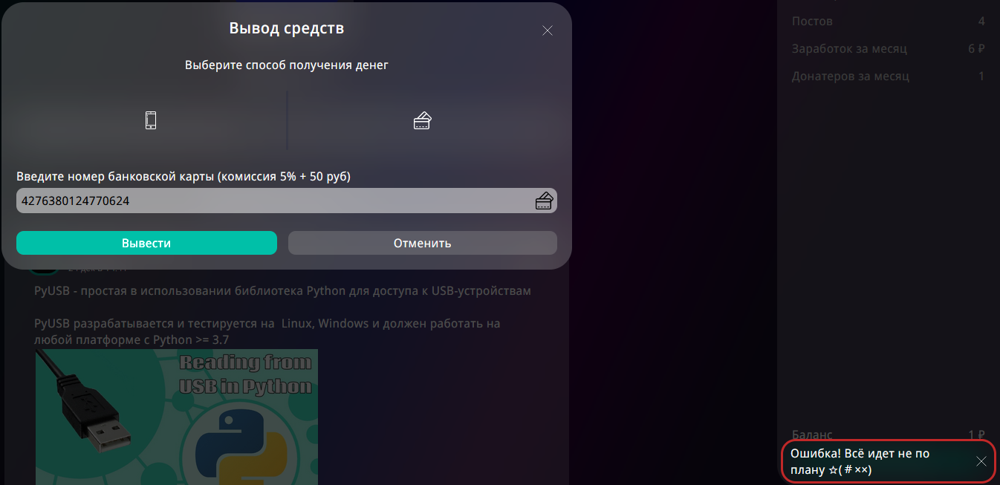
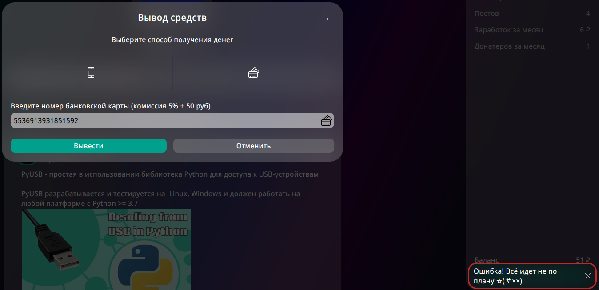
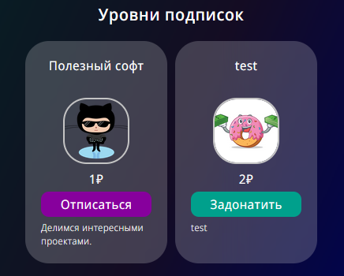

# Тестирование оплаты и вывода

При желании подписаться на автора, нужно оплатить его подписку. Поэтому под оплатой подразувевается успешное пополнение баланса автора и приобретение желаемой подписки.

Автор же в свою очередь может вывести деньги на карточку или телефон (QIWI).

## 1. Оплата

В случае нехватки средств/ошибки в номере карты/ошибки в номере телефона ошибка будет на стороне сервиса оплаты. Уведомление на vdonate приходит только, если выйдет время оплаты или оплата будет успешной.

- Нажатие на кнопку оплата редиректит на сервис оплаты ✅
- После перехода по ссылке устанавливается таймер 5 минут ✅
- После перехода по ссылке пришется краткая информация о транзакции ✅

- По истечении 5 минут приходит уведомление о том, что вышел срок оплаты ✅
- Уведомление о том, что вышел срок оплаты приходит без перезагрузки страницы ✅
- Оплата по карточке ✅
- Оплата по номеру QIWI ✅
- После оплаты автоматический редирект с QIWI на страницу автора ✅
- Уведомление об успешной оплате ✅
- Уведомление об успешной оплате приходит без перезагрузки страницы ✅
- Подписка после успешной оплаты ✅

## 2. Баланс и вывод средств

- Проверяем транзакцию из секции [оплата](#1-оплата)
- Уведомление о подписке юзера с именем "name" ✅
- Пополнение баланса ✅
- Кнопка "Вывести деньги" ✅
- Только ввод цифр ✅
- Некорректная длина номера телефона ✅
- Номера нет в пуле обслуживаемых стран ✅
- Вывод баланса на правильный телефон ✅ 
- Некорректная длина номера карты ✅
- Несуществующий номер карты ❌
> **[БАГ]**
>
> Ожидание: Ошибка о несуществующем номере карты
>
> Реальность: Ошибка с кодом 500
> 
> 
- Вывод на существующий номер карты с нехваткой баланса для коммисии (50 рублей + 5%) ❌
> **[БАГ]**
>
> Ожидание: Ошибка о нехватке баланса
>
> Реальность: Ошибка с кодом 500
>
> 
- Вывод на существующий номер карты ❌
> **[БАГ]**
>
> Ожидание: Средства выводятся
>
> Реальность: Ошибка с кодом 500
>
> 

# Тестирование смены подписки

Имеем такой кейс:

- При нажатии на кнопку "Задонатить" редиректит на сервис оплаты ✅
- При [оплате](#1-оплата) прошлая подписка отменяется, а новая применяется ✅
- Автору приходит уведомление, что пользователь с "name" поменял подписку ❌
> **[БАГ]**
>
> Ожидание: Уведомление о смене подписке пользователя
>
> Реальность: Ничего не приходит
- Пополнение [баланса](#2-баланс-и-вывод-средств) автора ✅
