# Тестирование оплаты и вывода

При желании подписаться на автора, нужно оплатить его подписку. Поэтому под оплатой подразумевается успешное пополнение
баланса автора и приобретение желаемой подписки.

Автор же в свою очередь может вывести деньги на карточку или телефон (QIWI).

## 1. Оплата

В случае нехватки средств/ошибки в номере карты/ошибки в номере телефона ошибка будет на стороне сервиса оплаты.
Уведомление на vdonate приходит только, если выйдет время оплаты или оплата будет успешной.

1. Нажатие на кнопку оплата происходит редирект на сервис оплаты ✅
2. После редиректа на оплату устанавливается таймер 5 минут ✅
3. После редиректа на оплату пишется краткая информация о транзакции ✅

4. По истечении 5 минут приходит уведомление о том, что вышел срок оплаты ✅
5. Уведомление о том, что вышел срок оплаты приходит без перезагрузки страницы ✅
6. Оплата по карточке ✅
7. Оплата по номеру QIWI ✅
8. После оплаты автоматический редирект с QIWI на страницу автора ✅
9. Уведомление об успешной оплате ✅
10. Уведомление об успешной оплате приходит без перезагрузки страницы ✅
11. Подписка после успешной оплаты ✅

## 2. Баланс и вывод средств

1. Проверяем транзакцию из секции [оплата](#1-оплата)
2. Уведомление о подписке юзера с именем "name" ✅
3. Баланс в профиле автора пополнился ✅
4. Кнопка "Вывести деньги" ✅
5. Ввод цифр в окошко вывода доступен [0-9] ✅
6. Ввод латинских букв в окошко вывода недоступен ✅
7. Ввод кириллицы в окошко вывода недоступен ✅
8. Ввод спецсимволов в окошко вывода недоступен ✅
9. Ввод номера в окошко вывода длины меньше 11 недоступен ✅
10. Ввод номера в окошко вывода длины больше 11 недоступен ✅
11. Ввод номера в окошко вывода длины 11 доступен ✅
12. Вывод баланса на корректный номер телефона ✅
13. Вывод на номер, который есть в пуле стран (8...) доступен ✅
14. Вывод на номер, которого нет в пуле стран недоступен ✅
15. Вывод на не 16-тизначный (некорректный) номер карты недоступен ✅
16. Вывод на несуществующий номер карты ❌

> **[БАГ]**
>
> Ожидаемый результат: При нажатии на кнопку вывода появляется подсказка о несуществующем номере карты
>
> Фактический результат: При нажатии на кнопку вывода появляется ошибка с кодом 500 без подсказок
>
> 

17. Вывод на корректный номер карты с нехваткой баланса для комиссии (50 рублей + 5%) ❌

> **[БАГ]**
>
> Ожидаемый результат: При нажатии на кнопку вывода появляется подсказка о нехватке баланса
>
> Фактический результат: При нажатии на кнопку вывода появляется ошибка с кодом 500 без подсказки
>
> 

18. Вывод на корректный номер карты ❌

> **[БАГ]**
>
> Ожидаемый результат: При нажатии на кнопку вывода средства успешно выводятся
>
> Фактический результат: При нажатии на кнопку вывода появляется ошибка с кодом 500, средства остаются на аккаунте
>
> 

# Тестирование смены подписки

Имеем такой кейс:

1. При нажатии на кнопку "Задонатить" редиректит на сервис оплаты ✅
2. При [оплате](#1-оплата) прошлая подписка отменяется, а новая применяется ✅
3. При смене подписки пользователем, автору приходит уведомление, что пользователь с "name" поменял подписку ❌

> **[БАГ]**
>
> Ожидаемый результат: Приходит уведомление автору о смене подписке пользователя
>
> Фактический результат: Уведомление не приходит

4. Пополнение [баланса](#2-баланс-и-вывод-средств) автора ✅

## Тестирование Popup уведомлений

1. Всплывают потоком ✅
2. Пропадают через некоторое время ✅
3. При нажатии на крестик в pop-up'е, pop-up пропадает ✅
4. При переполнении экрана pop-up'ами, не уместившееся можно скроллить ❌
   > **[Баг]**
   >
   > Ожидание: Возможность скроллинга при переполнении экрана уведомлениями
   >
   > Реальность: При большом количестве pop-up'ов, экран переполняется, верхние(более старые) становятся недостигаемыми
   > 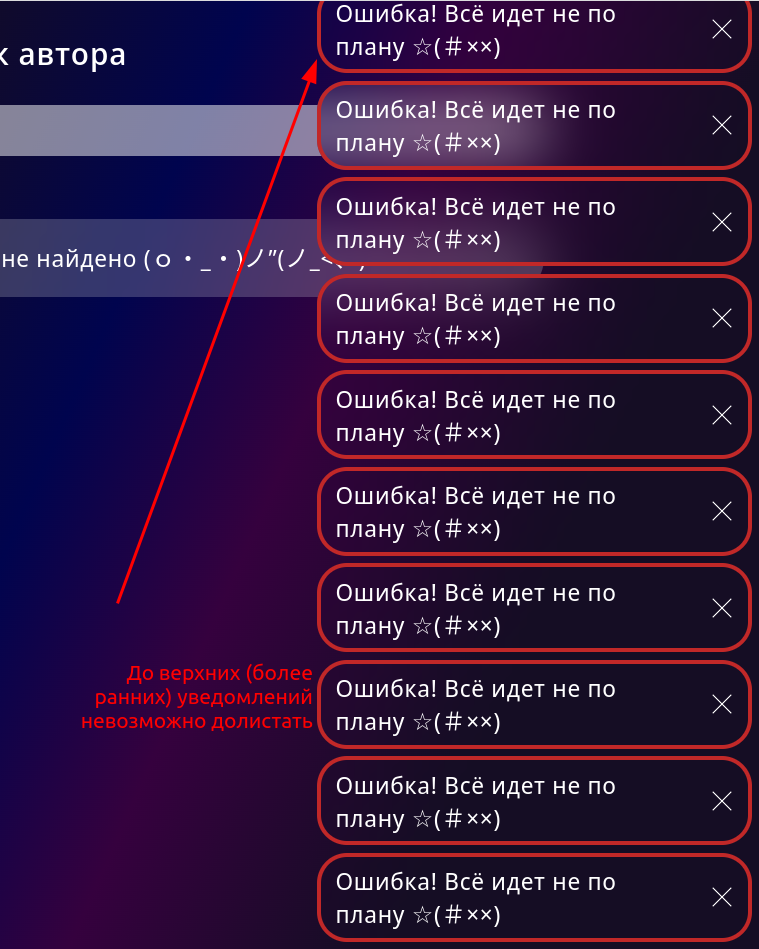

## Тестирование элементов левого меню

1. Нажатие на свой ник в правом сайд-баре открывает страницу профиля ✅
2. Нажатие на свою аватарку в правом сайд-баре открывает страницу профиля ✅
3. Кат в правом сайд-баре открывается при нажатии и закрывается при повторном нажатии ✅
4. Кнопка "Изменить данные" в кате в правом сайд-баре открывает форму редактирования профиля в оверлее ✅
5. Кнопка "Выйти" в кате в правом сайд-баре разлогинивает юзера и редиректит на страницу авторизации ✅
6. При нажатии на колокольчик в левом сайд-баре выводятся новые уведомления и сообщение "новых уведомлений нет" в случае
   их отсутствия. Повторное нажатие закрывает кат ✅
7. В левом меню активный пункт подсвечивается ✅
8. Нажатие на пункт левого меню "Поиск" открывает страницу поиска ✅

## Тестироввание страницы поиска:

1. При пустом поисковом запросе показывается подсказка ✅
2. Нажатие на "Найти" При пустом поисковом запросе показывает всех авторов ✅
3. Нажатие на юзера из списка найденных открывает его профиль ✅
4. У каждого найденного юзера отображается аватарка, имя и количество донатеров ✅
5. Если автор с указанным в поисковой строке ником не найден, в списке отображается сообщение "Не найдено" ✅
6. Ввод цифр ✅
7. Ввод латинских букв ✅
8. Ввод кириллицы ✅
9. Ввод спецсимволов ❌
   > **[Баг]**
   >
   > Ожидание: Сообщение о том, что пользователи не найдены.
   >
   > Реальность: Ввод спецсимволов по типу !""№%; выводит всех юзеров.
   > 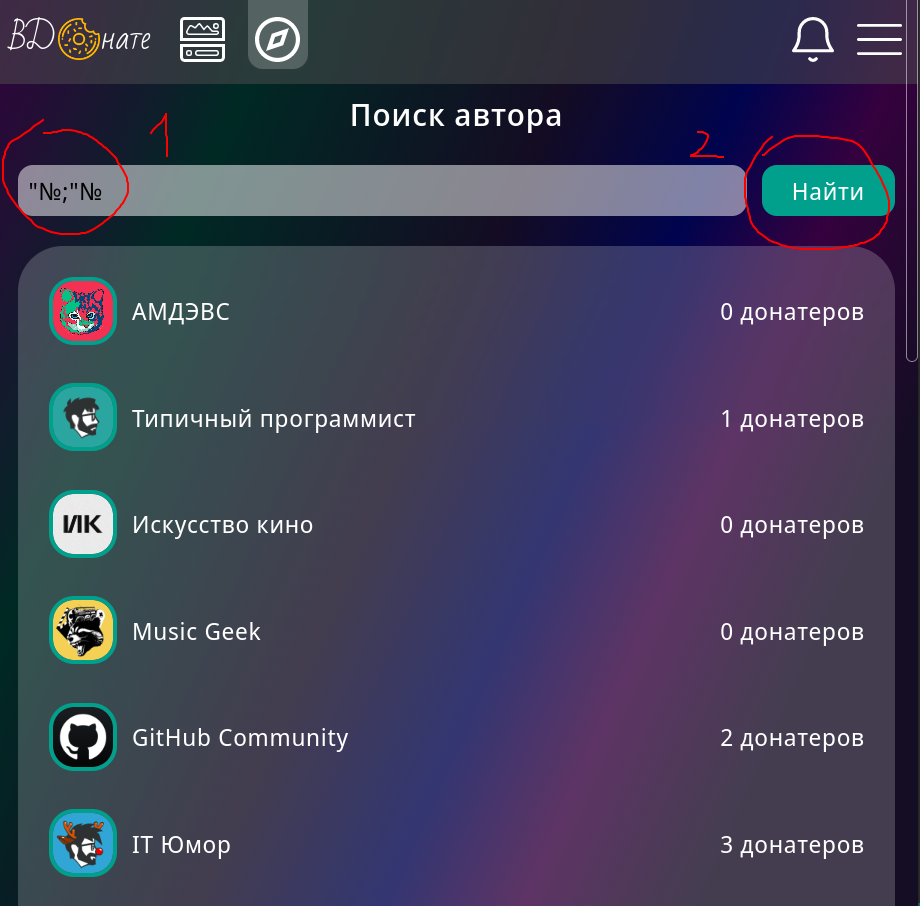
   >
   > PS: Кажется символ ";" вызывает ошибку.
10. Поиск по части слова ❌
    > **[Баг]**
    >
    > Ожидание: Список пользователей, в чьих именах присутствует часть их имени, например поиск 'они' в имени 'Тони'.
    >
    > Реальность: Поиск завершается неверно. При существующем пользователе 'Тони', ввести 'они', поиск выведет, что
    ничего не найдено.
    > 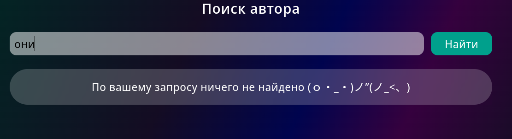
    > 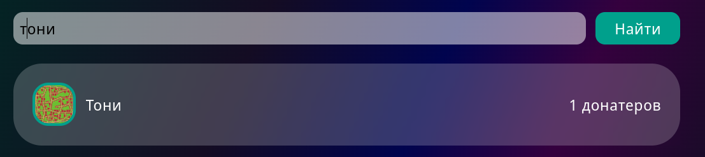
11. Поиск по нескольким словам, разделённым пробелом ❌
    > **[Баг]**
    >
    > Ожидание: Список юзеров или сообщение о том, что они не найдены
    >
    > Реальность: Появляется pop-up "что-то пошло не так"
    > 
12. Работает сабмит поиска при нажатии на enter ✅

## Тестирование страницы своего профиля:

1. Значок карандаша в левом сайд-баре открывает форму редактирования профиля в оверлее ✅
2. В режиме пользователя: в правом сайд-баре отображается количество подписок и кнопка "стать автором" ✅
3. Если количество подписок 0, то в блоке "Подписки" отображается подсказка "Перейти в поиск" ✅
4. Нажатие на кнопку "Стать автором" изменяет тип учетной записи на автора ✅
5. В режиме автора: В правом сайд-баре отображается количество донатеров, постов, донатеров за месяц; заработок за
   месяц, баланс и кнопку "Вывести деньги" ✅

## Тестирование страницы профиля юзера

1. В правом сайд-баре отображается аватарка, ник, количество донатеров, количество постов пользователя ✅
2. В правом сайд-баре нажатие на кнопку "Подписаться" оформляет подписку на юзера ✅
3. В правом сайд-баре нажатие на кнопку "Отписаться" отзывает подписку на юзера ✅

## Тестирование оверлея редактирования профиля:

1. Форма закрывается крестиком ✅
2. Форма закрывается кнопкой Отменить ✅
3. Запрос на сервер отправляется кнопкой Изменить ✅
4. Запрос на сервер не отправляется при некорректных данных ✅
5. Можно сабмитить поля по отдельности ✅
6. Клик вне формы не закрывает оверлей ✅

#### Тестирование поля для email:

1. Ввод цифр ✅
2. Ввод латинских букв ✅
3. Ввод нелатинских букв ✅
4. Ввод разрешённых спецсимволов !#$%&'*+-/=?^_`{|}~ ✅
5. Ввод неразрешенных спецсимволов ✅
6. Ввести обычный email (длина до 255 символов) ❌
   > **[Баг]**
   >
   > Ожидание: Ограничение на длину email 255 символов
   >
   > Реальность: Ограничение на длину email 64 символа
   > 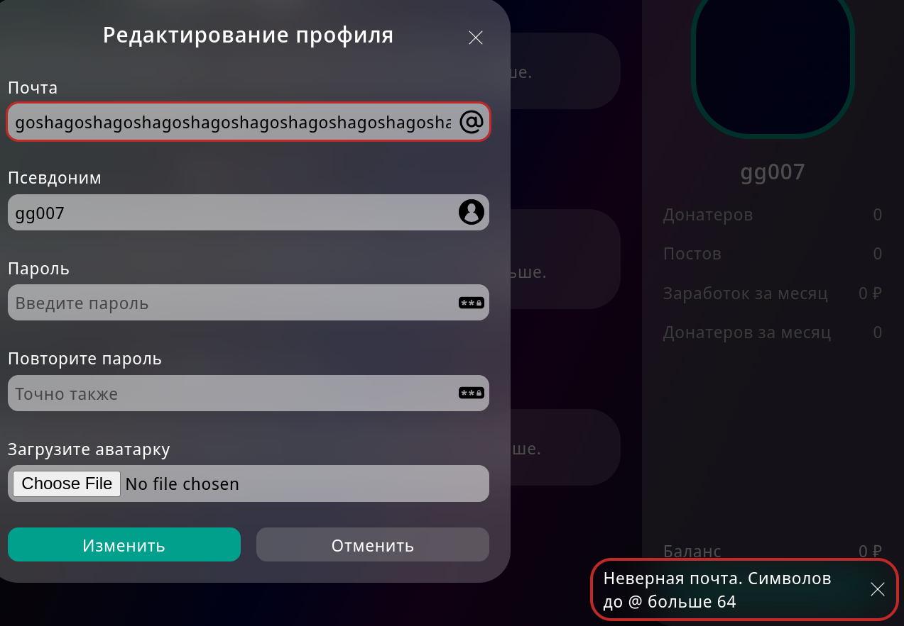
7. Ввести очень длинный email (более 255 символов) ✅
8. Ввести очень короткий email (a@b.c) ✅
9. Ввести почту без собаки ✅
10. Ввести почту без точки ✅
11. Ввести почту со спецсимволами в домене ✅
    > **[Замечание]**
    >
    > Ожидание: Сообщение о невалидном адресе
    >
    > Реальность: Запрос ушёл, сообщение об ошибке не вывелось. Домен может содержать спецсимволы?
    > 
12. Самбит пустого поля с email не изменяет email ✅
13. Подсказка при наведении на инпут отображается ✅
    > **[Замечание]**
    >
    > Ожидание: Информативная подсказка
    >
    > Реальность: Сообщение в подсказке несодержательное
    > 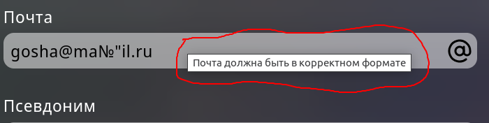
14. pop-up при сабмите невалидных данных показывается ✅
15. Красная рамка вокруг инпута при сабмите невалидных данных отображается ✅

#### Тестирование поля для никнейма:

1. Ввод цифр ✅
2. Ввод латинские буквы ✅
3. Ввод кириллицы ✅
4. Ввод знака нижнего подчеркивания между словами ✅
5. Ввод знака нижнего подчеркивания в начале ✅
6. Ввод знака нижнего подчеркивания в конце ✅
7. Ввод пробела между словами ✅
8. Ввод пробела в начало ✅
9. Ввод пробела в конц ✅
10. Ввод других (неразрешенных) спецсимволов ✅
11. Ввести короткий ник (менее 3 символов) ✅
12. Ввести длинный ник (более 20 символов) ✅
13. Самбит пустого поля не изменяет никнейм ✅
14. Подсказка при наведении на инпут отображается ✅
15. pop-up при сабмите невалидных данных отображается ✅
16. Красная рамка вокруг инпута при сабмите невалидных данных отображается ✅

#### Тестирование поля для пароля:

1. Ввод латиницы ✅
2. Ввод нелатинских букв ✅
3. Ввод цифр ✅
4. Ввод разрешенных спецсимволов: !@#$%^&*_ и пробел ✅
5. Ввод неразрешенных спецсимволов ✅
6. Сабмит короткого пароля (менее 5 символов) ✅
7. Сабмит длинного пароля (более 30 символов) ✅
8. Сабмит при пустом поле закрывает форму, не меняя пароль ✅
9. Подсказка при наведении на инпут ✅
10. pop-up при сабмите невалидных данных ✅
11. Красная рамка вокруг инпута при сабмите невалидных данных ✅
12. pop-up при сабмите несовпадающих паролей ✅
13. Красная рамка вокруг инпута повтора пароля при сабмите несовпадающих паролей ✅

#### Тестирование поля для выбора аватарки:

1. Сабмит без файла не меняет аватарку ✅
2. Можно выбрать только один файл ✅
3. Нельзя выбрать несколько файлов. ✅
4. Можно выбрать файл изображения (jpg, jpeg, png, svg, gif) ✅
5. Невозможно выбрать файл с расширением, отличным от изображения ❌
   > **[Баг]**
   >
   > Ожидание: Сообщение о неверном формате файла, невозможность попытки загрузки неверного файла на сервер.
   >
   > Реальность: Можно выбрать файл любого расширения и сделать сабмит. Возвращается 500 ошибка
   > 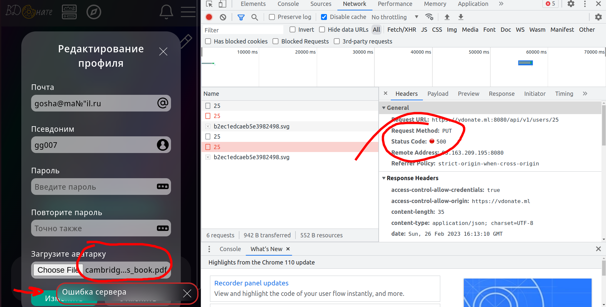
6. Ограничение на размер фото 3 Мб. Попробовать загрузить более тяжелое фото ❌
   > **[Баг]**
   >
   > Ожидание: Сообщение о том, что файл слишком велик
   >
   > Реальность: Размер загружаемой фотки не ограничен
   > 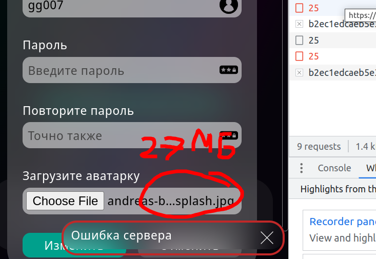

## Тестирование лайков к постам

1. Нажатие на кнопку "лайка" серого цвета увеличивает суммарное число на единицу; ❌
   > **[БАГ]**: При нажатии на кнопку лайка перед тем, как цвет поменяется, на месте "сердечка" на мгновение появляется
   лоадер.
   >
   > Ожидание: Появление лоадера происходить не должно.
   >
   > 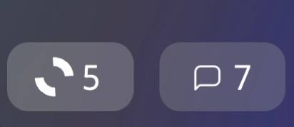
2. Нажатие на кнопку "лайка" фиолетового цвета уменьшает суммарное число на единицу; ✅
3. На каждый "лайк" автору приходит уведомление: "Пользователь @имя_пользователя оценил ваш пост"; ✅
4. На каждый отмененный "лайк" уведомление автору не приходит. ✅

## Тестирование комментариев к постам

1. При нажатии на кнопку "комментарий" под постом вылезают все комментарии; ❌
   > **[БАГ]**: При нажатии на кнопку комментария перед тем, как они появятся, на месте "сообщения" на мгновение
   появляется лоадер.
   >
   > Ожидание: Появление лоадера происходить не должно.
   >
   > 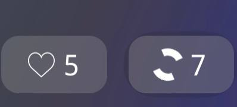
   >
   > **[БАГ]**: При нажатии на кнопку комментария в процессе их появления, верстка страницы может съезжать.
   >
   > Ожидание: Статичное появление комментариев.
>

2. При повторном нажатии комментарии скрываются; ✅
3. Обычное сообщение с комментарием успешно оставляется под постом при нажатии на кнопку "Отправить"; ✅
4. Сообщение с комментарием отправляется с помощью сочетания клавиш "Ctrl + Enter"; ✅
5. При попытке отправить пустой комментарий вылезает ошибка: "Вы ввели пустой комментарий"; ✅
6. При нажатии автором поста на крестик, расположенный справа от каждого сообщения, комментарий этого пользователя
   успешно удаляется; ✅
7. При нажатии автором комментария на крестик, расположенный справа от его сообщения, комментарий успешно удаляется. ✅

## Тестирование создания авторской подписки

1. Нажатие "плюса" около "Уровни подписок" приводит к появлению модального окна с пустыми формами для заполнения; ✅
2. Модальное окно успешно закрывается при нажатии крестика или кнопки "Отменить" в окне; ✅
3. Модальное окно не закрывается при нажатии вне его площади; ✅
4. Заголовок успешно валидируется при количестве символов в нем не меньше единицы и не больше 30:
    - При соблюдении этого и последующих условий подписка успешно создается; ✅
    - Иначе вылезает одна из двух ошибок: "Символов в заголовке больше 30" и "Символов в заголовке меньше 1"
      соотвтественно. ✅
    - При написании спецсимволов появится ошибка: "В заголовке разрешены латиница, кириллица, числа, символы !@#$%^&*_ и
      пробел между словами" ✅
5. Стоимость успешно валидируется при сумме, меньшей 1000000000 и большей 5 рублей:
    - При соблюдении условий подписка успешно создается; ✅
    - При попытке написать символ, отличный от символов цифр, поле никак не заполняется; ❌
      > **[БАГ]**: Попытка вставить текст, содержащий символы, отличные от цифр, обернется следующей ошибкой: "Укажите
      цену меньше 1"
      >
      > Ожидание: Вывод ошибки о том, что данный тип символов не является числом, либо не давать вставить текст в это
      поле.
      >
      > Реальность: Текст ошибки не дает точное обоснование ошибки.
      >
      > 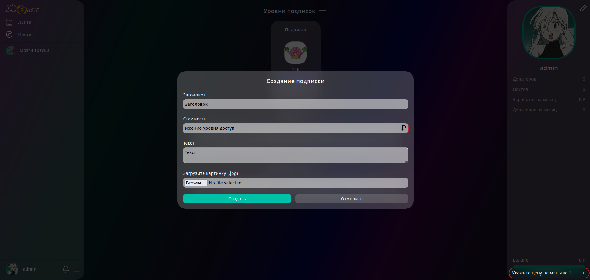
    - В случае непопадания вводимого числа в указанный промежуток, вылезут следующие ошибки: "Укажите цену не больше
      1000000000" и "Укажите цену меньше 1". ✅
6. Текст успешно валидируется при количестве символов больше 1 и меньше 128:
    - При соблюдении условий подписка успешно создается; ✅
    - Иначе вылезает одна из двух ошибок: "Символов в тексте больше 128" или "Символов в тексте меньше 1"
      соотвтетственно. ✅
7. При отсутствии картинки подписка успешно создается. ✅

## Тестирование изменения/удаления авторской подписки

> `NOTE`: Тестирование изменения и удаления авторской подписки было решено объединить, так как функционал изменения
> включает в себя функционал удаления подписки.

1. При уже созданной подписки нажатие кнопки "Изменить" приводит к появлению модального окна с заполненными текущими
   формами и тремя кнопками снизу: "Изменить", "Отменить", "Удалить" ✅
2. Поведение при валидации идентично созданию подписки ✅
3. Нажатие кнопки "Изменить" откроет модально окно, внизу которого будет красная кнопка "Удалить". Нажатие этой кнопки
   удаляет подписку; ❌

> **[БАГ]**: В случае, когда донатер покупает подписку, а автор затем ее удаляет, человек лишается заплаченного контента
> и деньги обратно не вернутся.
>
> Ожидание: Деньги должны вернуться отправителю.
>
> Реальность: Средства остаются на счету у автора.

## Редактирование описания "Обо мне"

Ручное тестирование функционала реактирования описания профиля. Находится на личной странице каждого пользователя.

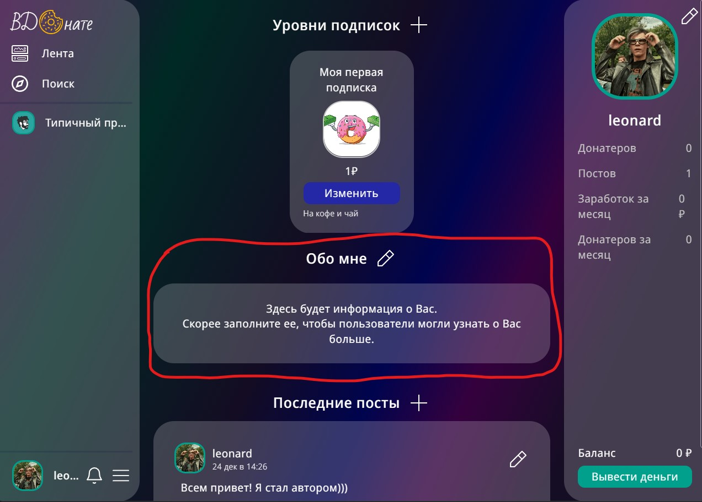

1. Нажатие на значек редактирования ✅
2. Нажатие на значек редактирования после ввода текста ✅
3. Нажатие на кнопку "Сохранить" при пустом поле ✅
4. Нажатие на кнопку "Отмена" при пустом поле ✅
5. Нажание на кнопку "Сохранить" с введенным текстом ✅
6. Нажатие на кнопку "Отмена" c введенным текстом ✅
7. Нажание на кнопку "Сохранить" с неизменненым текстом ✅
8. Нажатие на кнопку "Отмена" c неизменненым текстом ✅
9. Нажание на кнопку "Сохранить" после добавление пробелов в начало/конец ✅
10. Нажатие на кнопку "Отмена" после добавление пробелов в начало/конец ✅
11. Нажание на кнопку "Сохранить" удаление всего текста ❌

> **[БАГ]**
>
> Ожидание: Очистка всего описания и отображение в поле описание текста с уведомлением об отсутствии описания
>
> Реальность: Выплывает уведомление об ошибке длины описания
> 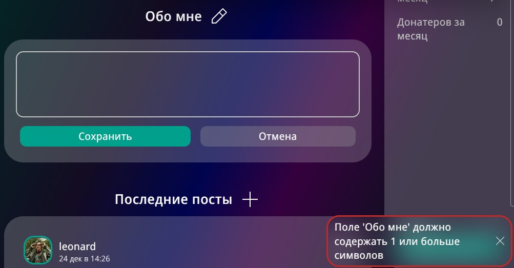

12. Нажатие на кнопку "Отмена" после добавление пробелов в начало/конец ✅
13. Сохранение со строкой **\** в поле ввода текста ✅
14. Сохранение со строкой **\** в элементе ввода текста (через инструменты
    разработчика) ✅
15. Сохранение текста из 2000 символов ✅
16. Сохранение описания нажатием комбинации Shift+Enter после ввода текста ✅

## Создание поста

Ручное тестирование функционала создания постов.

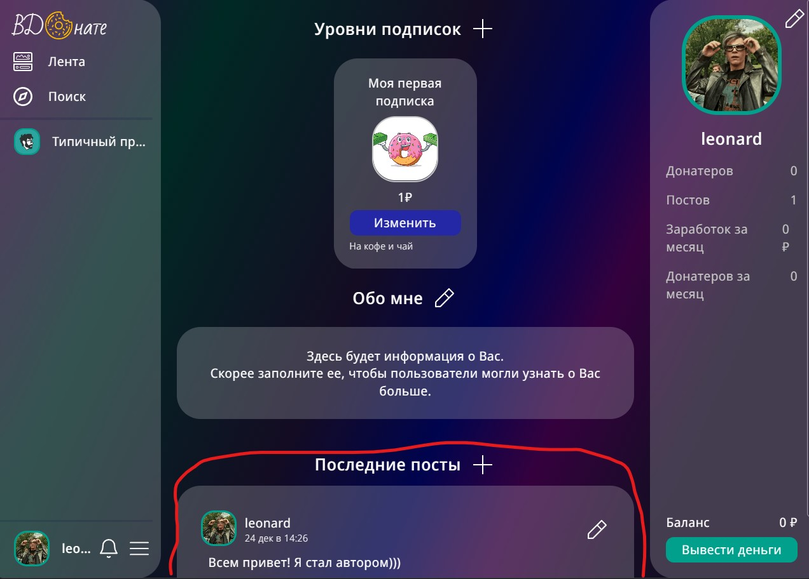

1. Нажатие на кнопку "Отмена" после изменения поста ✅
2. Повторное нажатие на значек создания с пустым полем ввода ✅
3. Повторное нажатие на значек создания с непустым полем ввода ✅
4. Создание поста через кнопку "Создать" ✅
5. Создание поста через комбинацию Shift+Enter ❌

> **[БАГ]**
>
> Ожидание: Создание поста
>
> Реальность: Перенос строки

6. Создание поста с картинкой/картинками внутри текста ✅
7. Создание поста с ограничением доступа ✅

## Редактирование поста

Ручное тестирование функционала редактирования постов.

1. Повышение уровня доступа к посту ✅
2. Повышение уровня доступа к посту ✅
3. Понижение уровня доступа к посту ✅
4. Установка уровня доступа к посту "для всех" ❌

> **[БАГ]**
>
> Ожидание: Снижение уровня доступа до "для всех"
>
> Реальность: Уровень не меняется

5. Удаление картинки через Backspace ✅
6. Удаление всего контента поста и нажатие на кнопку "Сохранить" ❌

> **[БАГ]**
>
> Ожидание: Вывод ошибки о минимальной длине поста
>
> Реальность: Сохранение пустого поста

7. Удаление поста ✅
8. Добавление картинки в режиме медленного интеренета ❌

> **[БАГ]**
>
> Ожидание: Блокировка всех действий, кроме отмены редактирования и удаления поста
>
> Реальность: После начал загрузки не блокируется ввод текста, нелогичная анимация кнопки сохранить (сейчас анимация
> загрузки, правильнее было бы сделать серым или что-то подобное), анимация загрузки на кнопке добавления картинки прыгает
> наверх поста
> 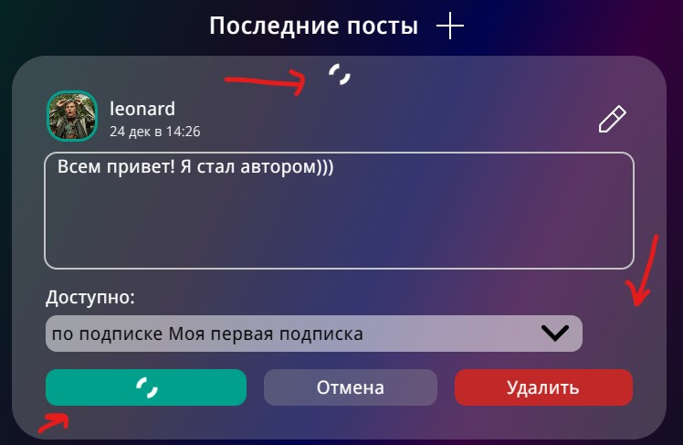
