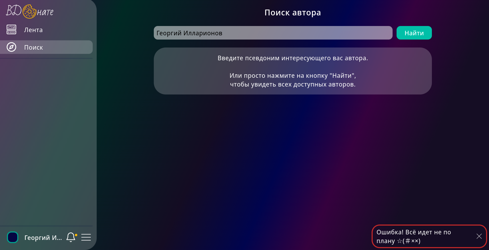

# Тестирование оплаты и вывода

При желании подписаться на автора, нужно оплатить его подписку. Поэтому под оплатой подразумевается успешное пополнение
баланса автора и приобретение желаемой подписки.

Автор же в свою очередь может вывести деньги на карточку или телефон (QIWI).

## 1. Оплата

В случае нехватки средств/ошибки в номере карты/ошибки в номере телефона ошибка будет на стороне сервиса оплаты.
Уведомление на vdonate приходит только, если выйдет время оплаты или оплата будет успешной.

1. Нажатие на кнопку оплата редиректит на сервис оплаты ✅
2. После перехода по ссылке устанавливается таймер 5 минут ✅
3. После перехода по ссылке пишется краткая информация о транзакции ✅


4. По истечении 5 минут приходит уведомление о том, что вышел срок оплаты ✅
5. Уведомление о том, что вышел срок оплаты приходит без перезагрузки страницы ✅
6. Оплата по карточке ✅
7. Оплата по номеру QIWI ✅
8. После оплаты автоматический редирект с QIWI на страницу автора ✅
9. Уведомление об успешной оплате ✅
10. Уведомление об успешной оплате приходит без перезагрузки страницы ✅
11. Подписка после успешной оплаты ✅

## 2. Баланс и вывод средств

1. Проверяем транзакцию из секции [оплата](#1-оплата)
2. Уведомление о подписке юзера с именем "name" ✅
3. Баланс в профиле автора пополнился ✅
4. Кнопка "Вывести деньги" ✅
5. Ввод цифр доступен ✅
6. Ввод латинских букв недоступен ✅
7. Ввод кириллицы недоступен ✅
8. Ввод спецсимволов недоступен ✅
9. Ввод номера длины меньше 11 недоступен ✅
10. Ввод номера длины больше 11 недоступен ✅
11. Ввод номера длины 11 доступен ✅
12. Вывод баланса на корректный номер телефона ✅
13. Вывод на номер, который есть в пуле стран (8...) доступен ✅
14. Вывод на номер, которого нет в пуле стран недоступен ✅
15. Вывод на 16-тизначный (некорректный) номер карты недоступен ✅
16. Вывод на несуществующий номер карты ❌

> **[БАГ]**
>
> Ожидание: Ошибка о несуществующем номере карты
>
> Реальность: Ошибка с кодом 500
>
> 

17. Вывод на корректный номер карты с нехваткой баланса для комиссии (50 рублей + 5%) ❌

> **[БАГ]**
>
> Ожидание: Ошибка о нехватке баланса
>
> Реальность: Ошибка с кодом 500
>
> 

18. Вывод на корректный номер карты ❌

> **[БАГ]**
>
> Ожидание: Средства выводятся
>
> Реальность: Ошибка с кодом 500
>
> 

# Тестирование смены подписки

Имеем такой кейс:


1. При нажатии на кнопку "Задонатить" редиректит на сервис оплаты ✅
2. При [оплате](#1-оплата) прошлая подписка отменяется, а новая применяется ✅
3. Автору приходит уведомление, что пользователь с "name" поменял подписку ❌

> **[БАГ]**
>
> Ожидание: Уведомление о смене подписке пользователя
>
> Реальность: Ничего не приходит

4. Пополнение [баланса](#2-баланс-и-вывод-средств) автора ✅

## Тестирование Popup уведомлений
1. Уведомления всплывают вверх потоком в правом нижнем углу, более старые продвигаются вверх ✅
2. Пропадают через некоторое время автоматически ✅
3. При нажатии на крестик в pop-up уведомлении, оно пропадает ✅
4. При переполнении экрана pop-up'ами, не уместившееся можно скроллить ❌
   > **[Баг]**
   > При получении большого количества уведомлений одновременно 
   >
   > Ожидаемый результат: Возможность скроллинга при переполнении экрана
   > 
   > Фактический результат: При большом количестве pop-up'ов, экран переполняется, верхние(более старые) уведомления становятся недостигаемыми
   > 
 
## Тестирование элементов левого меню
1. Нажатие на свой ник в правом сайд-баре открывает страницу профиля ✅
2. Нажатие на свою аватарку в правом сайд-баре открывает страницу профиля ✅
3. Кат в правом сайд-баре открывается при нажатии и закрывается при повторном нажатии ✅
4. Кнопка "Изменить данные" в кате в правом сайд-баре открывает форму редактирования профиля в оверлее ✅
5. Кнопка "Выйти" в кате в правом сайд-баре разлогинивает юзера и перенаправляет на страницу авторизации ✅
6. При нажатии на колокольчик в левом сайд-баре выводятся новые уведомления и сообщение "новых уведомлений нет" в случае их отсутствия. Повторное нажатие закрывает кат ✅
7. В левом меню активный пункт подсвечивается ✅
8. Нажатие на пункт левого меню "Поиск" открывает страницу поиска ✅

## Тестирование страницы поиска: 
1. При пустом поисковом запросе показывается подсказка ✅
2. Нажатие на "Найти" При пустом поисковом запросе показывает всех авторов ✅
3. Нажатие на юзера из списка найденных открывает его профиль ✅
4. У каждого найденного юзера отображается аватарка, имя и количество донатеров ✅
5. Если автор с указанным в поисковой строке ником не найден, в списке отображается сообщение "Не найдено" ✅
6. Поисковой запрос может содержать числа ✅
7. Поисковой запрос может содержать латинские буквы ✅
8. Поисковой запрос может содержать кириллицу ✅
9. Поисковой запрос может содержать спецсимволы (!"№;%:?*()_=+) ❌
    > **[Баг]**
    > При вводе в поисковую строку спецсимволов и отправке формы поиска, выводится неверный результат.
    >
    > Ожидаемый результат: Сообщение о том, что пользователи не найдены или список пользователей, в чьём имени содержатся спецсимволы.
    > 
    > Фактический результат: Выводится список всех юзеров.
    > 
    >
    > PS: Кажется символ ";" вызывает ошибку.
10. Поиск работает при вводе части имени, вместо полного  ❌
    > **[Баг]**
    > При попытке найти пользователя "Тони", введя поисковой запрос "они" выводится неверный результат
    >
    > Ожидаемый результат: Список пользователей, в чьих именах присутствует часть их имени, например поиск 'они' в имени 'Тони'. 
    > 
    > Фактический результат: Поиск завершается неверно. При существующем пользователе 'Тони', и запросе 'они', поиск выведет, что ничего не найдено.
    > 
    > 
11. Поиск по нескольким словам, разделённым пробелом ❌
    > **[Баг]**
    > Ввести в поисковой запрос несколько слов через пробел и нажать на кнопку "Поиск"
    > 
    > Ожидаемый результат: Список юзеров, в чьих именах присутствуют введённые слова, или сообщение о том, что ни один пользователь по запросу не найден
    > 
    > Фактический результат: Появляется pop-up "что-то пошло не так"
    > 
12. Поиск выполняется с введённым поисковым запросом при нажатии на enter ✅

## Тестирование страницы своего профиля:
1. Значок карандаша в левом сайд-баре открывает форму редактирования профиля в оверлее ✅
2. В режиме пользователя: в правом сайд-баре отображается количество подписок и кнопка "стать автором" ✅
3. Если количество подписок 0, то в блоке "Подписки" отображается подсказка "Перейти в поиск" ✅
4. Нажатие на кнопку "Стать автором" изменяет тип учетной записи на автора ✅
5. В режиме автора: В правом сайд-баре отображается количество донатеров, постов, донатеров за месяц; заработок за месяц, баланс и кнопку "Вывести деньги" ✅

## Тестирование страницы профиля юзера
1. В правом сайд-баре отображается аватарка, ник, количество донатеров, количество постов пользователя ✅
2. В правом сайд-баре нажатие на кнопку "Подписаться" оформляет подписку на юзера ✅
3. В правом сайд-баре нажатие на кнопку "Отписаться" отзывает подписку на юзера ✅

## Тестирование оверлея редактирования профиля:
1. Форма закрывается крестиком ✅
2. Форма закрывается кнопкой Отменить ✅
3. Запрос на сервер отправляется кнопкой Изменить ✅
4. Запрос на сервер не отправляется при некорректных данных ✅
5. Можно редактировать и сохранять результат каждого поля по отдельности ✅
6. Клик вне формы не закрывает оверлей ✅

#### Тестирование поля для email:
1. Email может содержать цифры ✅
2. Email может содержать латинские буквы ✅
3. Email не может содержать нелатинские буквы ✅
4. Email может содержать только разрешённые спецсимволы !#$%&'*+-/=?^_`{|}~ ✅
5. Email не может содержать неразрешенные спецсимволы (остальные) ✅
6. Невозможно установить email длиной более 320 символов в сумме✅
6. Возможно установить email длиной менее 320 символов в сумме✅
7. Невозможно установить email c длинной частью после собаки (более 255 символов) ✅
8. Возможно установить email, если длина части после собаки менее 255 символов ✅
9. Невозможно установить email c длинной частью до собаки (более 64 символов) ✅
10. Возможно установить email, если часть до собаки имеет длину менее 64 символов ✅
11. Невозможно установить email, если один из уровней домена длинее 64 символов ✅
12. Возможно установить email, если один из уровней домена короче 64 символов ✅
13. Возможно установить очень короткий email (a@b.c) ✅
14. Попытка адрес без собаки выводит сообщение об ошибке ✅
15. Попытка ввести почту без точки в домене выводит сообщение об ошибке✅
16. Возможно ввести почту с разрешенными спецсимволами ✅
    > Допустимые символы: прописные буквы (A-Z), строчные буквы (az), цифры (0-9), точка (.), апостроф ('), тире (-), решётка (#), собака (@), процент (%), амперсанд (&), косая черта) (/) и пробелы. Никакие другие символы не допускаются.
17. Невозможно ввести почту с запрещенными спецсимволами ❌
    > **[Баг]**
    > При попытке установить адрес, по типу ```george@m*a*i*l.ru``` запрос уходит на сервер и ошибки не возникает
    > 
    > Ожидаемый результат: Сообщение о невалидном адресе
    >
    > Фактический результат: Запрос ушёл, сообщение об ошибке не вывелось.
    > 
18. Самбит пустого поля с email не изменяет email ✅
19. Подсказка при наведении на инпут отображается ❌
    > **[БАГ]**
    > При наведении на поле для почты, появляется подсказка, которая указывает на структуру адреса.
    >
    > Ожидаемый результат: Информативная подсказка
    >
    > Фактический результат: Сообщение в подсказке несодержательное
    > 
20. pop-up при отправке невалидных данных показывается ✅
21. Красная рамка вокруг инпута при отправке невалидных данных отображается ✅

#### Тестирование поля для никнейма:
1. Никнейм может содержать цифры ✅
2. Никнейм может содержать латинские буквы ✅
3. Никнейм может содержать кириллицу ✅
4. Никнейм может содержать знак нижнего подчеркивания между словами ✅
5. Никнейм может содержать знак нижнего подчеркивания в начале ✅
6. Никнейм может содержать знак нижнего подчеркивания в конце ✅
7. Никнейм может содержать пробел между словами ✅
8. Никнейм не может содержать пробел в начале строки ✅
9. Никнейм не может содержать пробел в конце строки ✅
10. Никнейм не может содержать других (неразрешенных) спецсимволов ✅
11. Никнейм не может быть менее 3 символов ✅
12. Никнейм не может содержать быть более 20 символов ✅
13. Самбит пустого поля не изменяет никнейм ✅
14. Подсказка при наведении на инпут отображается ✅
15. pop-up при  отправке невалидных данных отображается ✅
16. Красная рамка вокруг инпута при отправке невалидных данных отображается ✅

#### Тестирование поля для пароля:
1. Пароль может содержать латиницу ✅
2. Пароль не может содержать нелатинских букв ✅
3. Пароль может содержать цифры ✅
4. Пароль может содержать разрешенные спецсимволы: !@#$%^&*_ и пробел ✅
5. Пароль не может содержать неразрешенные спецсимволы ✅
6. Сохранение короткого пароля (менее 5 символов) выводит сообщение об ошибке✅
7. Сохранение длинного пароля (более 30 символов) выводит сообщение об ошибке ✅
8. Сохранение при пустом поле закрывает форму, не меняя пароль ✅
9. Подсказка при наведении на инпут отображается ✅
10. pop-up при отправке невалидных данных появляется ✅
11. Красная рамка вокруг инпута при отправке невалидных данных отображается ✅
12. pop-up при отправке несовпадающих паролей появляется ✅
13. Красная рамка вокруг инпута повтора пароля при отправке несовпадающих паролей отображается ✅

#### Тестирование поля для выбора аватарки:
1. Отправка формы без файла не меняет аватарку ✅
2. Можно выбрать только один файл ✅
3. Нельзя выбрать несколько файлов. ✅
4. Можно выбрать файл изображения (jpg, jpeg, png, svg, gif) ✅
5. Невозможно выбрать файл с расширением, отличным от изображения ❌ 
   > **[Баг]**
   > Если нажать на "Выбрать файл", где в модальном окне указать "Все файлы *.*", после чего выбрать файл, отличный от изображения (напр: doc.pdf), и затем нажать на кнопку "Изменить", то при загруке на сервер вернется ошибка 500. Т.е. проверка на соответствие типа файла не выполняется.
   > 
   > Ожидаемый результат: Сообщение о неверном формате файла, невозможность попытки загрузки неверного файла на сервер.
   > 
   > Фактический результат: Можно выбрать файл любого расширения и отправить форму. Возвращается 500 ошибка
   > 
6. Ограничение на размер загружаемого фото (более 3 Мб) работает ❌
   > **[Баг]**
   > Если нажать на "Выбрать файл", после чего в модальном окне указать выбрать файл-изображение (напр: ava.png) размером более 3 мб и нажать на кнопку "Изменить", то запрос успешно выполнится без проверки размера изображения.
   > 
   > Ожидаемый результат: Сообщение о том, что файл слишком велик.
   > 
   > Фактический результат: Размер загружаемой фотки не ограничен.
   > 

## Тестирование лайков к постам

1. Нажатие на кнопку "лайка" серого цвета увеличивает суммарное число на единицу; ❌
    > **[БАГ]**: При нажатии на кнопку лайка перед тем, как цвет поменяется, на месте "сердечка" на мгновение появляется лоадер.
    >
    > Ожидание: Появление лоадера происходить не должно.
    >
    > 
2. Нажатие на кнопку "лайка" фиолетового цвета уменьшает суммарное число на единицу; ✅
3. На каждый "лайк" автору приходит уведомление: "Пользователь @имя_пользователя оценил ваш пост"; ✅
4. На каждый отмененный "лайк" уведомление автору не приходит. ✅

## Тестирование комментариев к постам

1. При нажатии на кнопку "комментарий" под постом вылезают все комментарии; ❌
    > **[БАГ]**: При нажатии на кнопку комментария перед тем, как они появятся, на месте "сообщения" на мгновение появляется лоадер.
    >
    > Ожидание: Появление лоадера происходить не должно.
    >
    > 
    >
    > **[БАГ]**: При нажатии на кнопку комментария в процессе их появления, верстка страницы может съезжать.
    >
    > Ожидание: Статичное появление комментариев.
    >

2. При повторном нажатии комментарии скрываются; ✅
3. Обычное сообщение с комментарием успешно оставляется под постом при нажатии на кнопку "Отправить"; ✅
4. Сообщение с комментарием отправляется с помощью сочетания клавиш "Ctrl + Enter"; ✅
5. При попытке отправить пустой комментарий вылезает ошибка: "Вы ввели пустой комментарий"; ✅
6. При нажатии автором поста на крестик, расположенный справа от каждого сообщения, комментарий этого пользователя успешно удаляется; ✅
7. При нажатии автором комментария на крестик, расположенный справа от его сообщения, комментарий успешно удаляется. ✅

## Тестирование создания авторской подписки

1. Нажатие "плюса" около "Уровни подписок" приводит к появлению модального окна с пустыми формами для заполнения; ✅
2. Модальное окно успешно закрывается при нажатии крестика или кнопки "Отменить" в окне; ✅
3. Модальное окно не закрывается при нажатии вне его площади; ✅
4. Заголовок успешно валидируется при количестве символов в нем не меньше единицы и не больше 30: 
    - При соблюдении этого и последующих условий подписка успешно создается; ✅
    - Иначе вылезает одна из двух ошибок: "Символов в заголовке больше 30" и "Символов в заголовке меньше 1" соотвтественно. ✅
    - При написании спецсимволов появится ошибка: "В заголовке разрешены латиница, кириллица, числа, символы !@#$%^&*_ и пробел между словами" ✅
5. Стоимость успешно валидируется при сумме, меньшей 1000000000 и большей 5 рублей:
    - При соблюдении условий подписка успешно создается; ✅
    - При попытке написать символ, отличный от символов цифр, поле никак не заполняется; ❌
        > **[БАГ]**: Попытка вставить текст, содержащий символы, отличные от цифр, обернется следующей ошибкой: "Укажите цену меньше 1"
        >
        > Ожидание: Вывод ошибки о том, что данный тип символов не является числом, либо не давать вставить текст в это поле.
        >
        > Реальность: Текст ошибки не дает точное обоснование ошибки.
        >
        > 
    - В случае непопадания вводимого числа в указанный промежуток, вылезут следующие ошибки: "Укажите цену не больше 1000000000" и "Укажите цену меньше 1". ✅
6. Текст успешно валидируется при количестве символов больше 1 и меньше 128: 
    - При соблюдении условий подписка успешно создается; ✅
    - Иначе вылезает одна из двух ошибок: "Символов в тексте больше 128" или "Символов в тексте меньше 1" соотвтетственно. ✅
7. При отсутствии картинки подписка успешно создается. ✅

## Тестирование изменения/удаления авторской подписки

> `NOTE`: Тестирование изменения и удаления авторской подписки было решено объединить, так как функционал изменения включает в себя функционал удаления подписки.

1. При уже созданной подписки нажатие кнопки "Изменить" приводит к появлению модального окна с заполненными текущими формами и тремя кнопками снизу: "Изменить", "Отменить", "Удалить" ✅ 
2. Поведение при валидации идентично созданию подписки ✅
3. Нажатие кнопки "Изменить" откроет модально окно, внизу которого будет красная кнопка "Удалить". Нажатие этой кнопки удаляет подписку; ❌

> **[БАГ]**: В случае, когда донатер покупает подписку, а автор затем ее удаляет, человек лишается заплаченного контента и деньги обратно не вернутся.
>
> Ожидание: Деньги должны вернуться отправителю.
>
> Реальность: Средства остаются на счету у автора.

## Редактирование описания "Обо мне"

Ручное тестирование функционала реактирования описания профиля. Находится на личной странице каждого пользователя.


1. Нажатие на значек редактирования ✅
2. Нажатие на значек редактирования после ввода текста ✅
3. Нажатие на кнопку "Сохранить" при пустом поле ✅
4. Нажатие на кнопку "Отмена" при пустом поле ✅
5. Нажание на кнопку "Сохранить" с введенным текстом ✅
6. Нажатие на кнопку "Отмена" c введенным текстом ✅
7. Нажание на кнопку "Сохранить" с неизменненым текстом ✅
8. Нажатие на кнопку "Отмена" c неизменненым текстом ✅
9. Нажание на кнопку "Сохранить" после добавление пробелов в начало/конец ✅
10. Нажатие на кнопку "Отмена" после добавление пробелов в начало/конец ✅
11. Нажание на кнопку "Сохранить" удаление всего текста ❌
> **[БАГ]**
>
> Ожидание: Очистка всего описания и отображение в поле описание текста с уведомлением об отсутствии описания
>
> Реальность: Выплывает уведомление об ошибке длины описания
> 
12. Нажатие на кнопку "Отмена" после добавление пробелов в начало/конец ✅
13. Сохранение со строкой **\** в поле ввода текста ✅
14. Сохранение со строкой **\** в элементе ввода текста (через инструменты разработчика) ✅
15. Сохранение текста из 2000 символов ✅
16. Сохранение описания нажатием комбинации Shift+Enter после ввода текста ✅

## Создание поста

Ручное тестирование функционала создания постов.


1. Нажатие на кнопку "Отмена" после изменения поста ✅
2. Повторное нажатие на значек создания с пустым полем ввода ✅
3. Повторное нажатие на значек создания с непустым полем ввода ✅
4. Создание поста через кнопку "Создать" ✅
5. Создание поста через комбинацию Shift+Enter ❌
> **[БАГ]**
>
> Ожидание: Создание поста
>
> Реальность: Перенос строки
6. Создание поста с картинкой/картинками внутри текста ✅
7. Создание поста с ограничением доступа ✅

## Редактирование поста

Ручное тестирование функционала редактирования постов.


1. Повышение уровня доступа к посту ✅
2. Повышение уровня доступа к посту ✅
3. Понижение уровня доступа к посту ✅
4. Установка уровня доступа к посту "для всех" ❌
> **[БАГ]**
>
> Ожидание: Снижение уровня доступа до "для всех"
>
> Реальность: Уровень не меняется
5. Удаление картинки через Backspace ✅
6. Удаление всего контента поста и нажатие на кнопку "Сохранить" ❌
> **[БАГ]**
>
> Ожидание: Вывод ошибки о минимальной длине поста
>
> Реальность: Сохранение пустого поста
7. Удаление поста ✅
8. Добавление картинки в режиме медленного интеренета ❌
> **[БАГ]**
>
> Ожидание: Блокировка всех действий, кроме отмены редактирования и удаления поста
>
> Реальность: После начал загрузки не блокируется ввод текста, нелогичная анимация кнопки сохранить (сейчас анимация загрузки, правильнее было бы сделать серым или что-то подобное), анимация загрузки на кнопке добавления картинки прыгает наверх поста
> 
