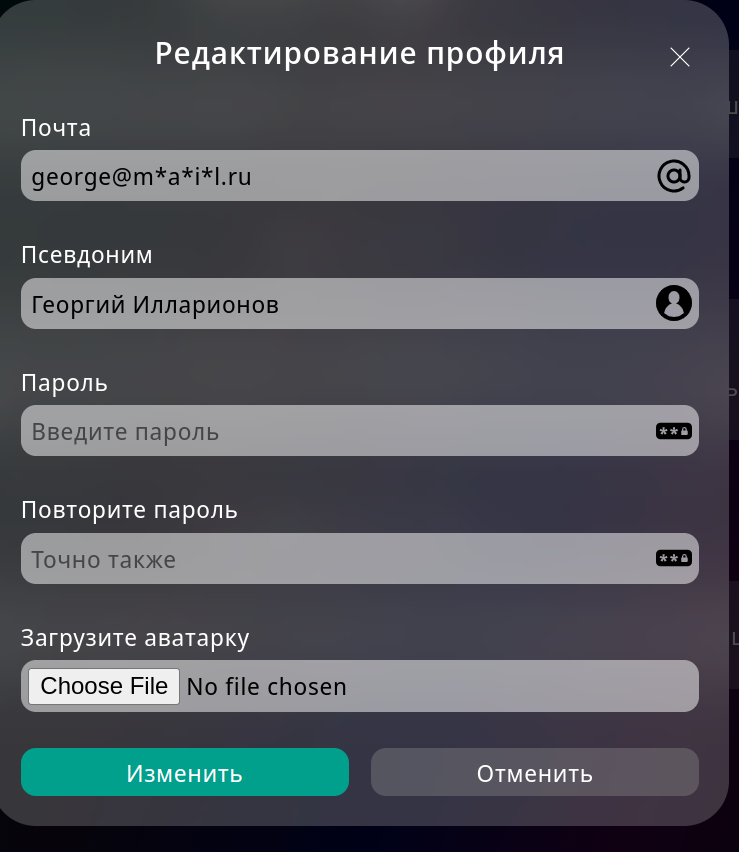

# Функциональное тестирование
# George007361 (Георгий Илларионов)

## Popup уведомления
- Всплывают потоком
- Пропадают через некоторое время
- При нажатии на крестик в pop-up'е, pop-up пропадает
- При переполнении экрана pop-up'ами, не уместившееся можно скроллить
> Баг: при большом количестве pop-up'ов, экран переполняется, верхние(более старые) становятся недостигаемыми 
> Ожидаемый результат: Возможность скроллинга при переполнении
> 
 
## Работа элементов меню
- Нажатие на свой ник в правом сайд-баре открывает страницу профиля
- Нажатие на свою аватарку в правом сайд-баре открывает страницу профиля
- Кат в правом сайд-баре открывается при нажатии и закрывается при повторном нажатии
- Кнопка "Изменить данные" в кате в правом сайд-баре открывает форму редактирования профиля в оверлее
- Кнопка "Выйти" в кате в правом сайд-баре разлогинивает юзера и редиректит на страницу авторизации
- При нажатии на колокольчик в левом сайд-баре выводятся новые уведомления и сообщение "новых уведомлений нет" в случае их отсутствия. Повторное нажатие закрывает кат.
- В левом меню активный пункт подсвечивается
- Нажатие на пункт левого меню "Поиск" открывает страницу поиска 

## Страница поиска: 
- При пустом поисковом запросе показывается подсказка 
- Нажатие на "Найти" При пустом поисковом запросе показывает всех авторов
- Нажатие на юзера из списка найденных открывает его профиль
- У каждого найденного юзера отображается аватарка, имя и количество донатеров
- Если автор с указанным в поисковой строке ником не найден, в списке отображается сообщение "Не найдено". 
- Ввод цифр
- Ввод латинских букв
- Ввод кириллицы
- Ввод спецсимволов
> Баг: ввод спецсимволов по типу !""№%; выводит всех юзеров.
> Ожидаемый результат: сообщение о том, что пользователи не найдены.
> 
> PS: Кажется символ ";" вызывает ошибку.
- Поиск по части слова.
> Баг: Поиск завершается неверно. При существующем пользователе 'Тони', ввести 'они', поиск выведет, что ничего не найдено.
> 
> 
> Ожидаемый результат: Список пользователей, в чьих именах присутствует часть 'они'. 
- Поиск по нескольким словам, разделённым пробелом.
> Баг: появляется pop-up "что-то пошло не так"
> Ожидаемый результат: список юзеров или сообщение о том, что они не найдены
> 
- Работает сабмит поиска при нажатии на enter

## Страница своего профиля:
- Значок карандаша в левом сайд-баре открывает форму редактирования профиля в оверлее
- В режиме пользователя: в правом сайд-баре отображается количество подписок и кнопка "стать автором"
- Если количество подписок 0, то в блоке "Подписки" отображается подсказка "Перейти в поиск"
- Нажатие на кнопку "Стать автором" изменяет тип учетной записи на автора
- В режиме автора: В правом сайд-баре отображается количество донатеров, постов, донатеров за месяц; заработок за месяц, баланс и кнопку "Вывести деньги"

## Страница профиля юзера
- В правом сайд-баре отображается аватарка, ник, количество донатеров, количество постов пользователя
- В правом сайд-баре нажатие на кнопку "Подписаться" оформляет подписку на юзера
- В правом сайд-баре нажатие на кнопку "Отписаться" отзывает подписку на юзера

## Оверлей редактирования профиля:
- Форма закрывается крестиком
- Форма закрывается кнопкой Отменить
- Запрос на сервер отправляется кнопкой Изменить
- Запрос на сервер не отправляется при некорректных данных
- Можно сабмитить поля по отдельности
- Клик вне формы не закрывает оверлей

#### Поле для email:
- Ввод цифр
- Ввод латинских букв
- Ввод нелатинских букв
- Ввод разрешённых спецсимволов !#$%&'*+-/=?^_`{|}~.
- Ввод неразрешенных спецсимволов
- Ввести обычный email (длина до 255 символов)
> Баг: Ограничение на длину email 64 символа
> Ожидаемый результат: Ограничение на длину email 255 символов
> 
- Ввести очень длинный email (более 255 символов)
- Ввести очень короткий email (a@b.c) 
- Ввести почту без собаки
- Ввести почту без точки
- Ввести почту со спецсимволами в домене 
> Замечание: Запрос ушёл, сообщение об ошибке не вывелось. Домен может содержать спецсимволы?
> Ожидаемый результат: Сообщение о невалидном адресе
> 
- Самбит пустого поля с email не изменяет email
- Подсказка при наведении на инпут отображается 
> Замечание: Сообщение в подсказке несодержательное
> 
- pop-up при сабмите невалидных данных показывается
- Красная рамка вокруг инпута при сабмите невалидных данных отображается

#### Поле для ника:
- Ввод цифр
- Ввод латинские буквы
- Ввод кириллицы
- Ввод знака нижнего подчеркивания между словами
- Ввод знака нижнего подчеркивания в начале
- Ввод знака нижнего подчеркивания в конце
- Ввод пробела между словами
- Ввод пробела в начало
- Ввод пробела в конц 
- Ввод других (неразрешенных) спецсимволов
- Ввести короткий ник (менее 3 символов)
- Ввести длинный ник (более 20 символов)
- Самбит пустого поля не изменяет никнейм
- Подсказка при наведении на инпут отображается
- pop-up при  сабмите невалидных данных отображается 
- Красная рамка вокруг инпута при сабмите невалидных данных отображается

#### Поле для пароля:
- Ввод латиницы
- Ввод нелатинских букв
- Ввод цифр
- Ввод разрешенных спецсимволов: !@#$%^&*_ и пробел
- Ввод неразрешенных спецсимволов
- Сабмит короткого пароля (менее 5 символов)
- Сабмит длинного пароля (более 30 символов)
- Сабмит при пустом поле закрывает форму, не меняя пароль
- Подсказка при наведении на инпут
- pop-up при сабмите невалидных данных 
- Красная рамка вокруг инпута при сабмите невалидных данных
- pop-up при сабмите несовпадающих паролей
- Красная рамка вокруг инпута повтора пароля при сабмите несовпадающих паролей

#### Поле для выбора аватарки:
- Сабмит без файла не меняет аватарку
- Можно выбрать только один файл
- Нельзя выбрать несколько файлов.
- Можно выбрать файл изображения (jpg, jpeg, png, svg, gif)
- Невозможно выбрать файл с расширением, отличным от изображения. 
> Баг: можно выбрать файл любого расширения и сделать сабмит. Возвращается 500 ошибка
> Ожидаемый результат: Сообщение о неверном формате файла, невозможность попытки загрузки неверного файла на сервер.
> 
- Ограничение на размер фото 3 Мб
> Баг: Размер загружаемой фотки не ограничен
> Ожидаемый результат: Сообщение о том, что файл слишком велик
> 